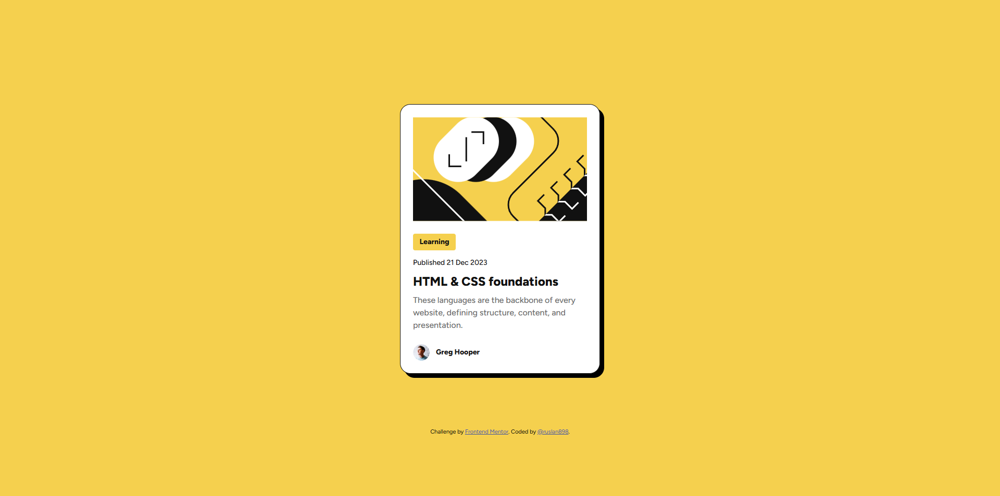

# Frontend Mentor - Blog preview card solution

This is a solution to the [Blog preview card challenge on Frontend Mentor](https://www.frontendmentor.io/challenges/blog-preview-card-ckPaj01IcS). Frontend Mentor challenges help you improve your coding skills by building realistic projects.

## Table of contents

- [Overview](#overview)
  - [The challenge](#the-challenge)
  - [Screenshot](#screenshot)
  - [Links](#links)
- [My process](#my-process)
  - [Built with](#built-with)
  - [What I learned](#what-i-learned)
  - [Useful resources](#useful-resources)
- [Author](#author)


## Overview

### The challenge

Users should be able to:

- See hover and focus states for all interactive elements on the page

### Screenshot



### Links

- Solution URL: https://github.com/ruslan898/frontend-mentor_blog-preview-card
- Live Site URL: [Add live site URL here](https://your-live-site-url.com)

## My process

### Built with

- Semantic HTML5 markup
- CSS custom properties
- Flexbox


### What I learned

While building this project I've learned how to use Flexbox to construct simple layouts. I've also used clamp() CSS function to dynamically change font size depending on screen resolution


```html
<h1 class="title">HTML & CSS foundations</h1>
```
```css
.title {
  font-size: clamp(1.25rem, 1.162rem + 0.376vw, 1.5rem);
}
```

### Useful resources

- [Clamp() Function Calculator](https://www.marcbacon.com/tools/clamp-calculator/) - This online service helped me calculate appropriate clamp() function values

## Author

- Frontend Mentor - [@ruslan898](https://www.frontendmentor.io/profile/ruslan898)
